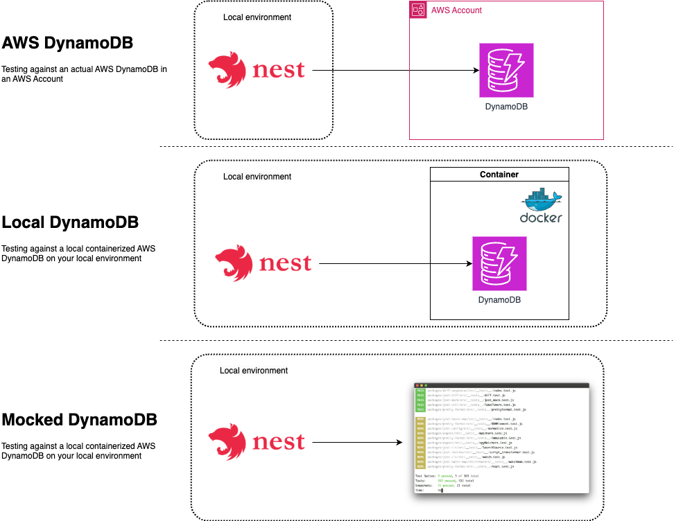

## Description

Sample [Nest](https://github.com/nestjs/nest) project using TypeScript with a simple CRUD controller to demonstrate 3 ways of testing



## Starting a NestJS project

The project was bootstrapped using the NestJS CLI using the `nest new` command to create a basic project.

```
nest new nestjs-testing
```

We then proceeded to create our Movie resource using the `nest g resource` CLI recipe, giving us a module, controller service, entity and DTOs.
```
base ❯ nest g resource
? What name would you like to use for this resource (plural, e.g., "users")? movies
? What transport layer do you use? REST API
? Would you like to generate CRUD entry points? Yes
CREATE src/movies/movies.controller.spec.ts (576 bytes)
CREATE src/movies/movies.controller.ts (915 bytes)
CREATE src/movies/movies.module.ts (255 bytes)
CREATE src/movies/movies.service.spec.ts (460 bytes)
CREATE src/movies/movies.service.ts (623 bytes)
CREATE src/movies/dto/create-movie.dto.ts (31 bytes)
CREATE src/movies/dto/update-movie.dto.ts (173 bytes)
CREATE src/movies/entities/movie.entity.ts (22 bytes)
UPDATE package.json (1986 bytes)
UPDATE src/app.module.ts (316 bytes)
✔ Packages installed successfully.
```

With that in place we can already install / start and build the application

## Installation

```bash
$ npm install
```

## Running the app

```bash
# development
$ npm run start

# watch mode
$ npm run start:dev

# production mode
$ npm run start:prod
```

## Test

For testing we can run unit tests , e2e tests and see our test coverage.
In this repo we will focus on the e2e tests, as this will setup our DynamoDB mocks.

```bash
# unit tests
$ npm run test

# e2e tests
$ npm run test:e2e

# test coverage
$ npm run test:cov
```

## Deploying against an AWS account

If you want to run the REST backend on AWS you'll need to deploy a DynamoDB table.

Take a look at my [cdk-simple-dynamodb](https://github.com/ddewaele/cdk-simple-dynamodb) repository for a quick way to deploy a DynamoDB table in your account.

## Setting up a local DynamoDB

If you don't want to rely on AWS you can spin-up a local dynamodb via this [docker compose](./docker-compose.yml)

```
services:
 dynamodb-local:
   command: "-jar DynamoDBLocal.jar -sharedDb -dbPath ./data"
   image: "amazon/dynamodb-local:latest"
   container_name: dynamodb-local
   ports:
     - "8000:8000"
   volumes:
     - "./docker/dynamodb:/home/dynamodblocal/data"
   working_dir: /home/dynamodblocal
```

It will pull in the `amazon/dynamodb-local` docker image, allowing you to have a dynamodb running on your computer.

You can interact with that local dynamoDB by running the following AWS CLI commands. Simply use the `--endpoint-url` parameter to point it to your local dynamoDB.
(If you are running against AWS simply omit the endpoint URL.)

the local dynamoDB does expect a dummy aws credentials setup.

You can use something like this in your `~/.aws/credentials` file : 

```
[local]
aws_access_key_id=dummy
aws_secret_access_key=dummy
region=eu-central-1
```

Activate it by exporting your `AWS_PROFILE` like this

```
export AWS_PROFILE=local
```

And you should be good to go.

Lets start by listing the dynamoDB tables.

```
aws dynamodb list-tables --endpoint-url http://localhost:8000
```

you shouldn't have any tables in the beginning

```
{
    "TableNames": []
}
```

Create a table

```
aws dynamodb create-table \
    --table-name MoviesTable \
    --attribute-definitions \
        AttributeName=PK,AttributeType=S \
        AttributeName=SK,AttributeType=S \
    --key-schema \
        AttributeName=PK,KeyType=HASH \
        AttributeName=SK,KeyType=RANGE \
    --billing-mode PAY_PER_REQUEST \
    --endpoint-url http://localhost:8000
```

After that you should see the table.

```
aws dynamodb list-tables --endpoint-url http://localhost:8000
```

you shouldn't have any tables in the beginning

```
{
    "TableNames": [
        "MoviesTable"
    ]
}
```

Scan the table
```
aws dynamodb scan \
    --table-name MoviesTable \
    --endpoint-url http://localhost:8000
```

Remove the table

```
aws dynamodb delete-table \
    --table-name MoviesTable \
     --endpoint-url http://localhost:8000
```


## Querying the REST API

Our Nest APP contains basic CRUD functionality to interact with our Movie resource.

You can use `restish` to interact with the API (or cURL if you like it a bit more verbose)

```
brew install danielgtaylor/restish/restish
```
Some sample commands.

```
restish POST localhost:3000/movies title: Terminator II, year:1992
restish POST localhost:3000/movies title: Alive, year:1993
restish GET localhost:3000/movies
restish PATCH localhost:3000/movies title: Alive_updated
restish GET localhost:3000/movies/01JDCCZDD7HWR3WVM0RB9V7B8F
restish DELETE localhost:3000/movies/01JDCCZDD7HWR3WVM0RB9V7B8F
```

## License

Nest is [MIT licensed](LICENSE).
